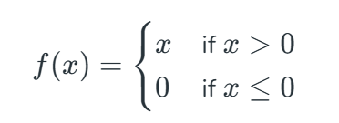

uhm...no biggie, made this to understand the various layers on a neural network, the code is broken but im going to fix it soon.

the input layer(for insertion) ---- hidden layer (with activation function for non-linearity)-----the output layer for predictions

I'll be using the ReLU activation function

the dataset I used is the MNIST DIGIT RECOGNIZER, with pure python
